[toc]

## android studio

### 位置迁移

听说Android studio sdk占用磁盘空间较多，同时还默认放在c盘，考虑将其移动


## arcore

### 教程

感觉这个技术更新的很快，youtube上的技术链要么有点落后，要么是kotlin的，查看官方文档

[为图像添加维度  | ARCore  | Google Developers](https://developers.google.cn/ar/develop/augmented-images?hl=zh-cn)

### 使用虚拟机

考虑到手上没有实机的话有点难调试，尝试使用虚拟机

[Run AR Apps In Android Emulator | Sceneform | ARCore - YouTube](https://www.youtube.com/watch?v=HHSaYnDUhm4)

尝试以上视频教程

选择SDK版本27


创建虚拟设备

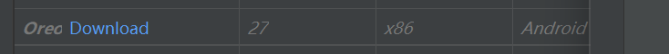

安装27版本的固件

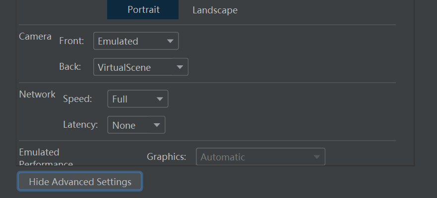

advanced setting中注意后摄是虚拟场景

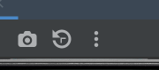

打开外部设置

修改openGL Renderer-maximum

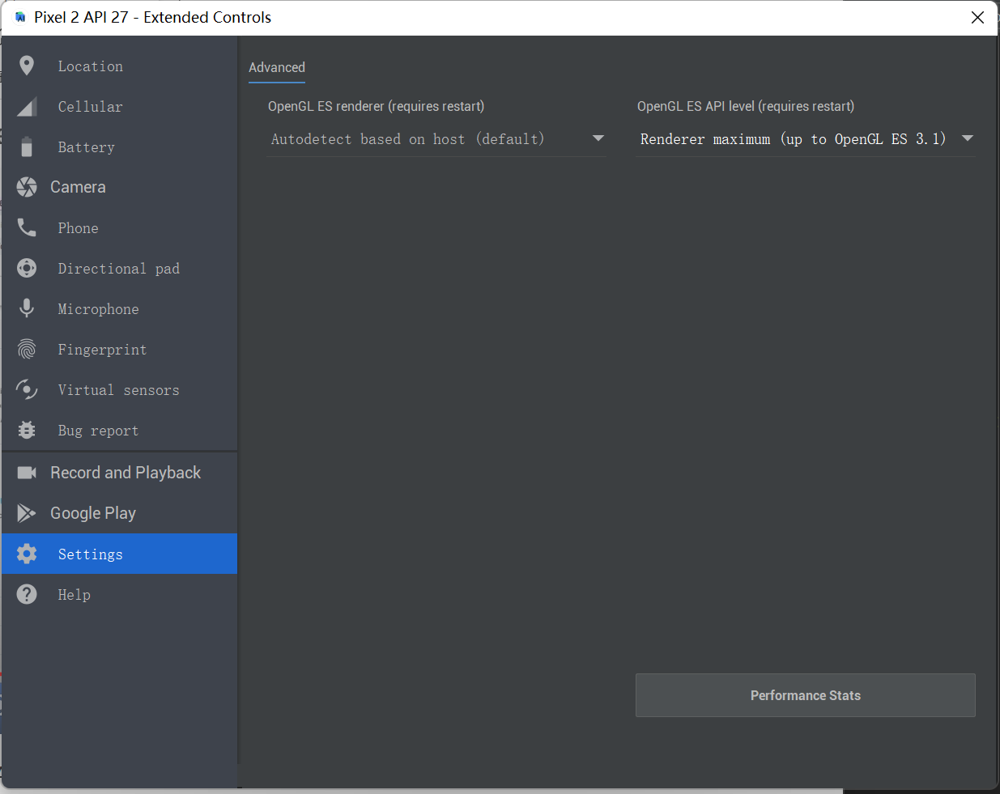

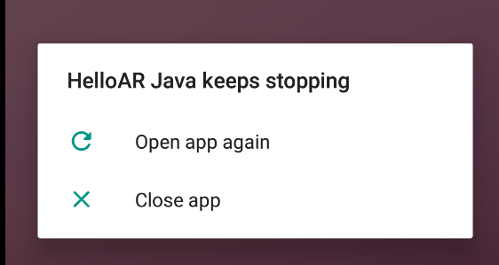

直接run出问题，可能是没装google ar service的原因

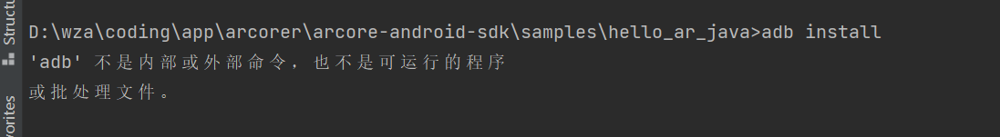

找不到adb

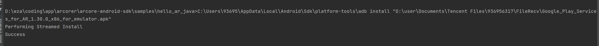

adb在sdk\platform-tool底下，先将就安装

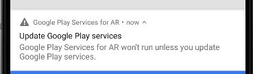

更新

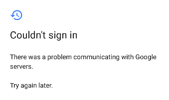

吐血

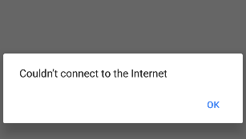


百度能上，不会要翻墙吧

更换虚拟机为api29

成功

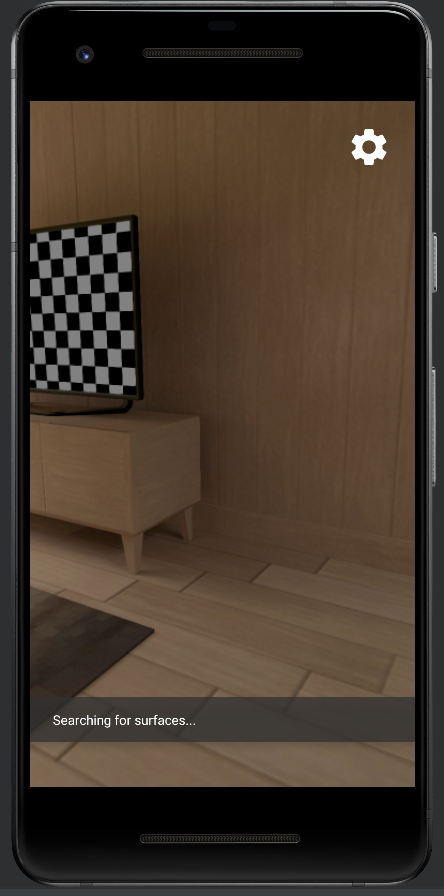


### adb找不到


### 尝试arcore官方文档

[启用 ARCore  | Google Developers](https://developers.google.cn/ar/develop/java/enable-arcore?hl=zh-cn)

#### Enable ARCore

##### Adding entries to your app's manifest

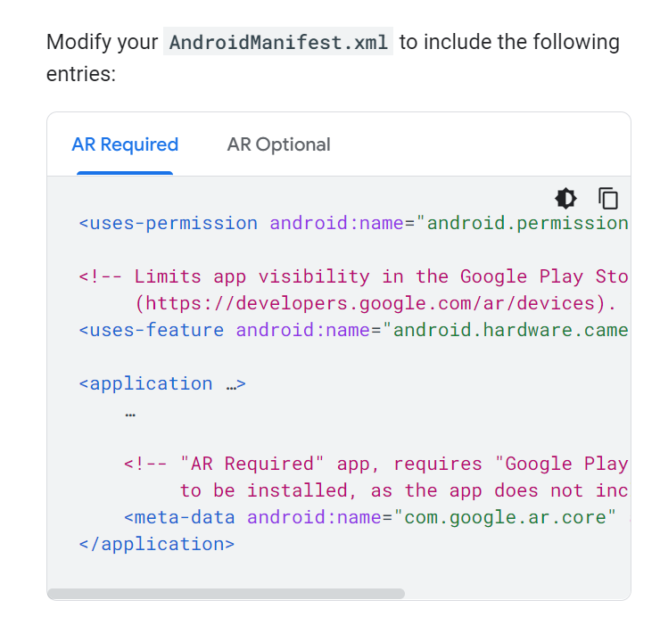

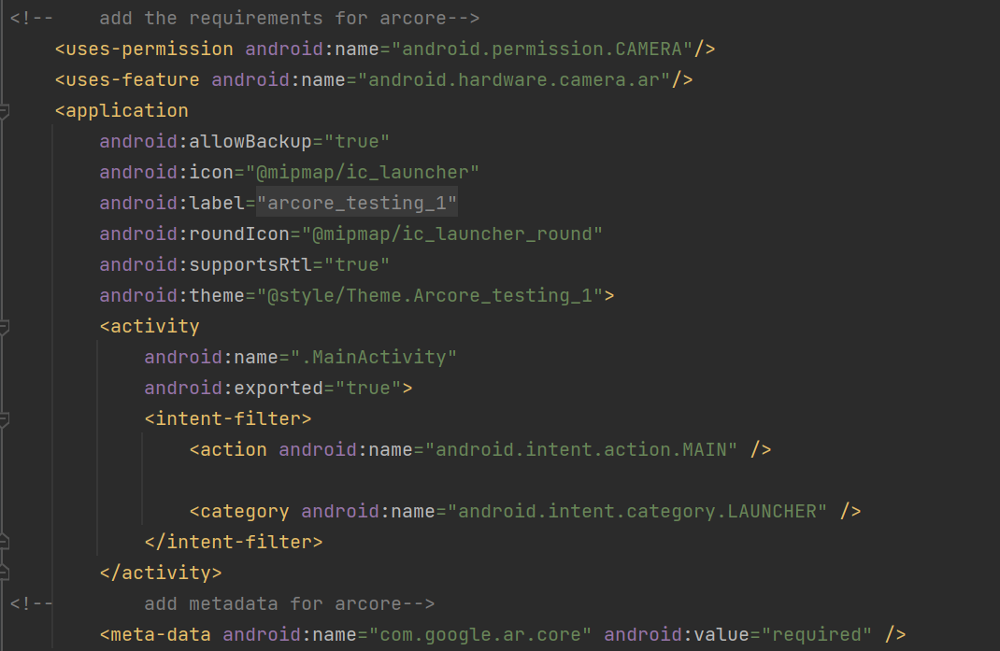

修改manifest.xml

首先通读教程，发现对于android sdk 有最低的版本需求：24 for arrequired

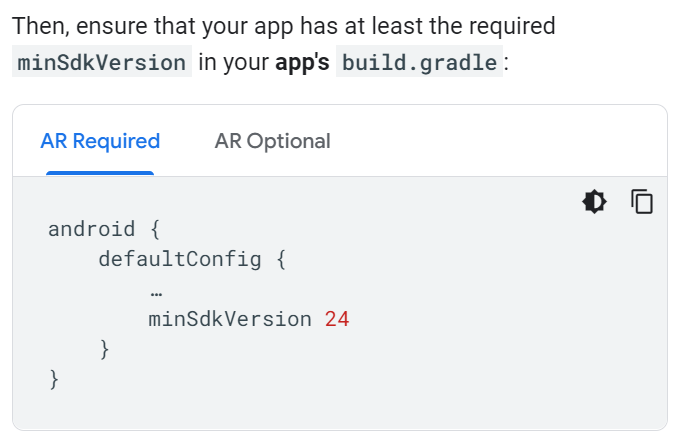

什么是AR required？

>An **AR Required** app cannot function without ARCore. To be usable, an AR Required app requires an [ARCore Supported Device](https://developers.google.cn/ar/discover/supported-devices) that has [Google Play Services for AR](https://play.google.com/store/apps/details?id=com.google.ar.core) installed on it.
>
>- The Google Play Store makes AR Required apps available only on [devices that support ARCore](https://developers.google.cn/ar/discover/supported-devices).
>- When users install an AR Required app, the Google Play Store automatically installs [Google Play Services for AR](https://play.google.com/store/apps/details?id=com.google.ar.core). However, your app must still perform additional [runtime checks](https://developers.google.cn/ar/develop/java/enable-arcore#runtime) in case Google Play Services for AR must be updated or has been manually uninstalled.
>
>An **AR Optional** app uses ARCore to augment a different functionality. An AR Optional app has optional AR features, which are activated only on [ARCore supported devices](https://developers.google.cn/ar/discover/supported-devices) that have [Google Play Services for AR](https://play.google.com/store/apps/details?id=com.google.ar.core) installed.
>
>- AR Optional apps can be installed and run on devices that don't support ARCore.
>- When users install an AR Optional app, the Google Play Store will *not* automatically install [Google Play Services for AR](https://play.google.com/store/apps/details?id=com.google.ar.core) with the app.

我的理解就是ar required app必须要有arcore，整体围绕ar进行，而ar optional 是可以选择ar进行某些功能的实现，而不强求一定能ar

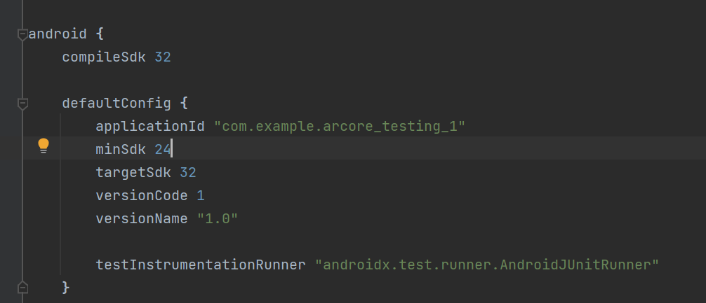

修改minSDK为24

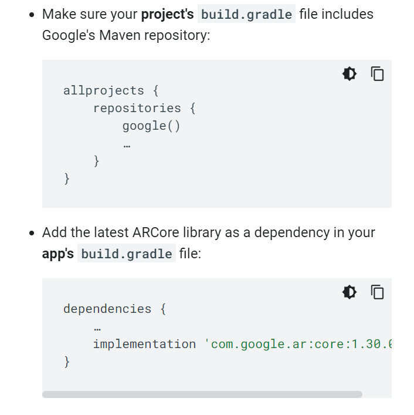

在app的build.gradle中添加dependency

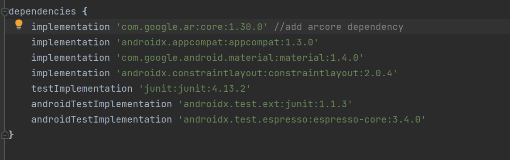

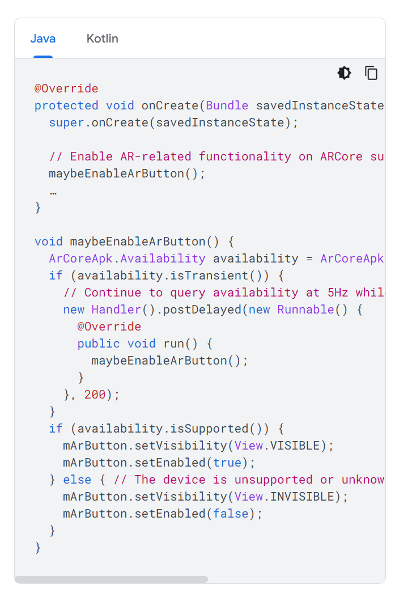

##### check whether ARCore is supported

在java中添加以下代码

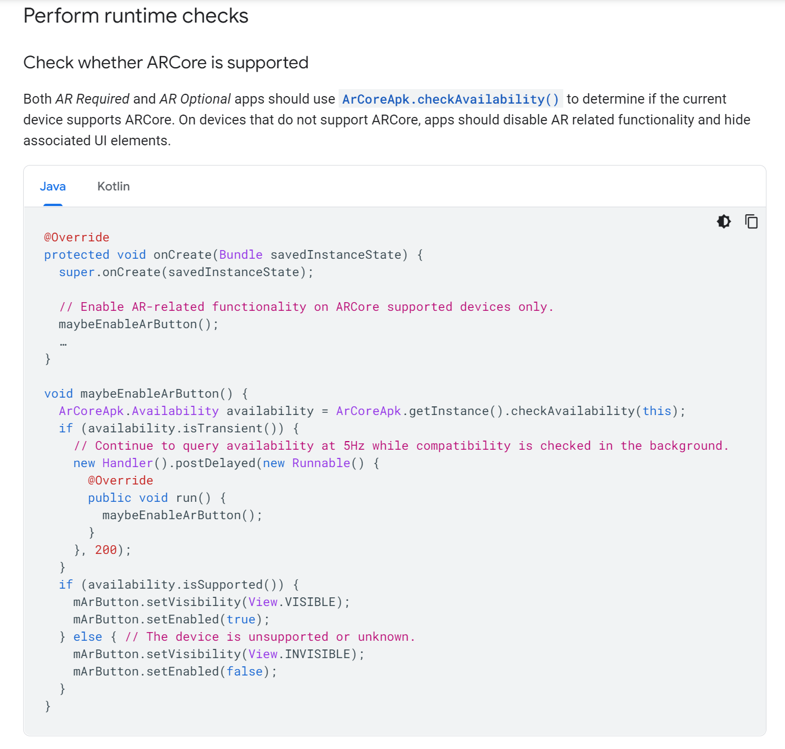

##### try to run

到此，尝试以下直接run

编译没有问题，但运行的时候出现如下错误：

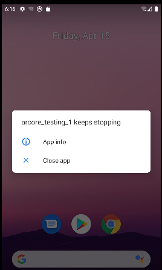

考虑可能是support_service没装？

但是helloar没有问题

查看log

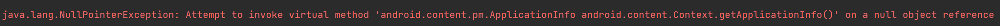

> 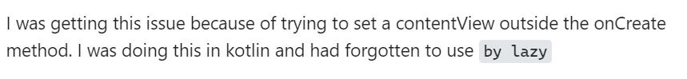

尝试将setcontentview 放到isARCoreAvailable前面，还是一样

尝试为按钮添加constrain，一样

删除中间的maybe.. 还是不行

那就说明是环境设置的问题？

##### reset all

是否可能是一开始环境设置错误?尝试重新进行环境设置

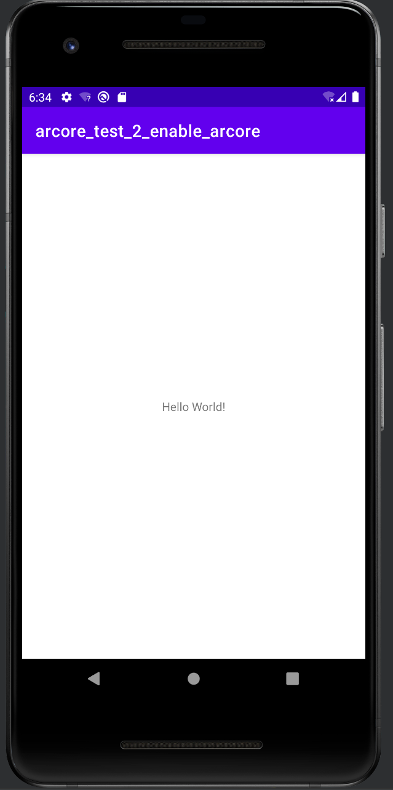

什么代码都不加,没问题

修改android manifest没有问题

本来想改这个

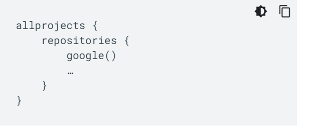

但是没找到

> [firebase - I didnt see Allprojects repositories - Stack Overflow](https://stackoverflow.com/questions/68740655/i-didnt-see-allprojects-repositories)

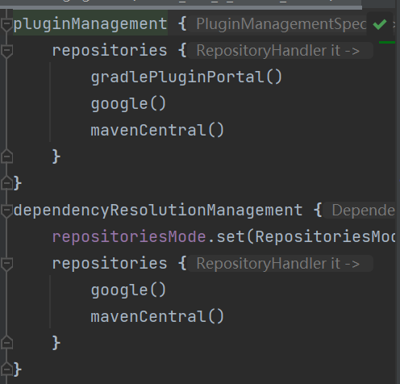

在setting.gradle中有,感觉没什么问题?

修改dependency

添加button没有问题

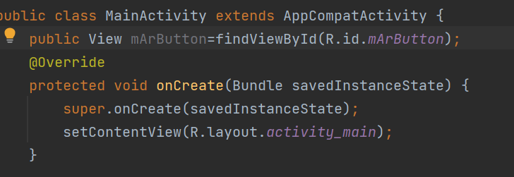

是在初始化成员变量的时候出现了问题!!!还没有create 窗口就获取控件

修改了之后,添加样例代码还是不行

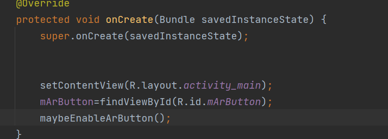

修改顺序如上即可!!

按照同样的方式修改test1也没问题

##### Request camera permission

尝试从hello中挖取cameraPermissionHelper

从helloar中查看项目目录

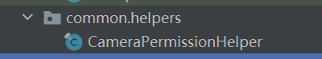

复制代码

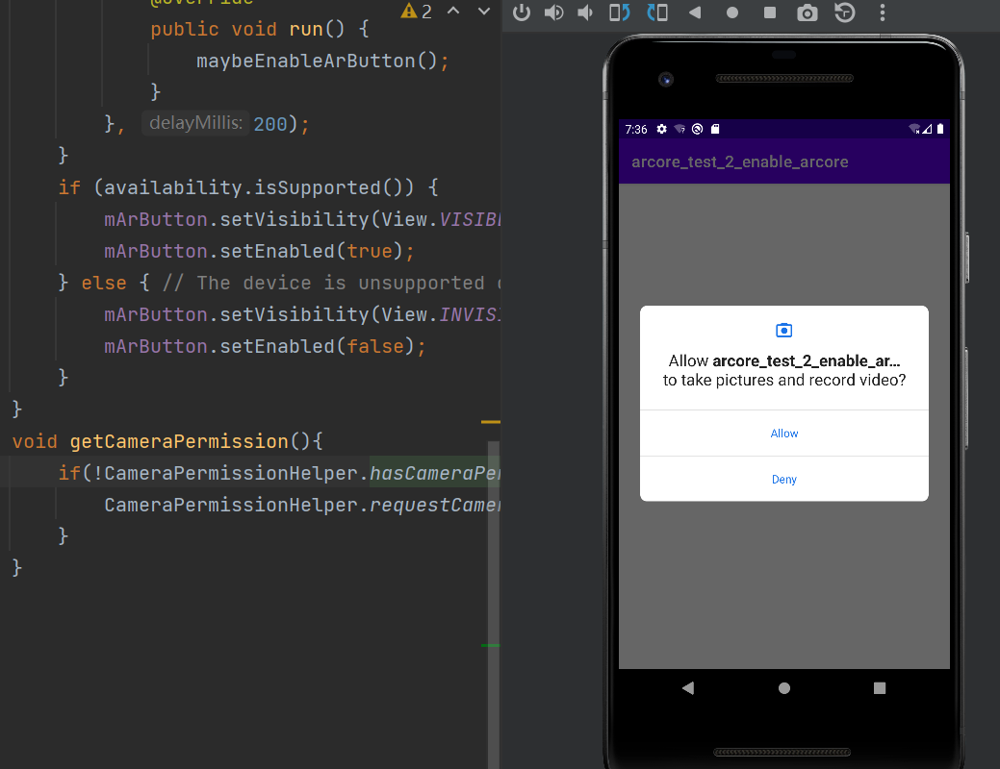

成功询问

抄写onRequestPermissionsResult

##### check whether Google Play Services for AR

直接复制onResume方法

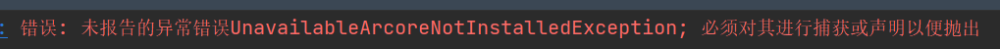

直接复制hello中的解决方案

```java
@Override
protected void onResume() {
    super.onResume();
    Exception exception = null;
    String message = null;
    // Check camera permission.
    if(CameraPermissionHelper.hasCameraPermission(this)){
        Toast.makeText(this,"camera permission is get",Toast.LENGTH_LONG).show();
    }
    // Ensure that Google Play Services for AR and ARCore device profile data are
    // installed and up to date.
    try {
        if (mSession == null) {
            switch (ArCoreApk.getInstance().requestInstall(this, mUserRequestedInstall)) {
                case INSTALLED:
                    // Success: Safe to create the AR session.
                    mSession = new Session(this);
                    break;
                case INSTALL_REQUESTED:
                    // When this method returns `INSTALL_REQUESTED`:
                    // 1. ARCore pauses this activity.
                    // 2. ARCore prompts the user to install or update Google Play
                    //    Services for AR (market://details?id=com.google.ar.core).
                    // 3. ARCore downloads the latest device profile data.
                    // 4. ARCore resumes this activity. The next invocation of
                    //    requestInstall() will either return `INSTALLED` or throw an
                    //    exception if the installation or update did not succeed.
                    mUserRequestedInstall = false;
                    return;
            }
        }
    } catch (UnavailableArcoreNotInstalledException
            | UnavailableUserDeclinedInstallationException e) {
        message = "Please install ARCore";
        exception = e;
    } catch (UnavailableApkTooOldException e) {
        message = "Please update ARCore";
        exception = e;
    } catch (UnavailableSdkTooOldException e) {
        message = "Please update this app";
        exception = e;
    } catch (UnavailableDeviceNotCompatibleException e) {
        message = "This device does not support AR";
        exception = e;
    } catch (Exception e) {
        message = "Failed to create AR session";
        exception = e;
    }

    if (message != null) {
        Toast.makeText(this,message,Toast.LENGTH_LONG).show();
        Log.e(TAG, "Exception creating session", exception);
        return;
    }
}
```

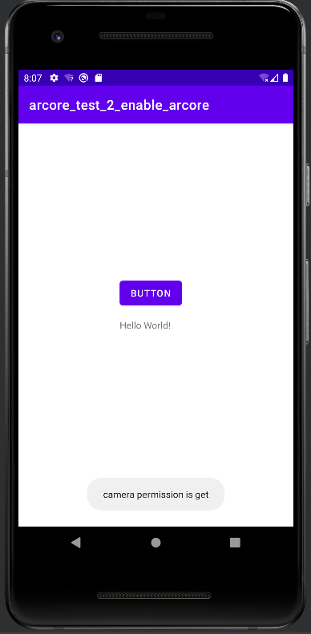

成功运行

总结session的构造过程

在onResume中进行新建,处理各种exception 

处理完exception后,进行configuration

在onDestory中进行close

## sceneform

### continuation of the archived Sceneform

项目地址：

[SceneView/sceneform-android: Sceneform Maintained is an ARCore Android SDK with Google Filament as 3D engine. This is the continuation of the archived Sceneform (github.com)](https://github.com/SceneView/sceneform-android)

尝试运行其中的demo

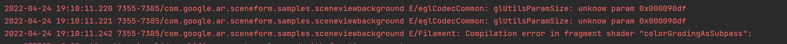

在虚拟机上运行不起来


[Make Your First Augmented Reality App | Part 2 | Sceneform | ARCore - YouTube](https://www.youtube.com/watch?v=0Xvo8CtRtZc&list=PLsOU6EOcj51cEDYpCLK_bzo4qtjOwDWfW&index=3)

查到了一个比较详细的视频教程，但是什么是sceneform?

### what is sceneform?

> 谷歌还发布了ARCore1.6版本，最大的特色是升级的Sceneform。Sceneform是Google针对Java的3D渲染库，之前默认为将环境光优化为黄色。由于默认现在是中性和白色，在Sceneform 1.6中渲染的对象看起来好像受到光线和颜色的影响更大。

### development with sceneform

首先通过plugin管理安装sceneform插件

接着修改编译脚本，添加依赖项


在dependency中添加


`implementation 'com.google.ar.sceneform.ux:sceneform-ux:1.17.1'`


保证这边代码正确


开始同步


切换manifest


添加以上两行代码，以打开摄像头权限和特性


添加这行代码

app下右键新建`sample data directory`里面的数据不会被打包进apk中

下载一个喜欢的obj 3d模型到sample中

右键`import sceneform asset`

但是没有出现这个选项

查找资料

[Getting started with Sceneform  | Sceneform (1.15.0)  | Google Developers](https://developers.google.com/sceneform/develop/getting-started)

double-check plugin是否安装成功

没有成功安装


出现这个问题

[android studio - 'Plugin "Google Sceneform Tools (Beta)" is incompatible (supported only in IntelliJ IDEA)' - Stack Overflow](https://stackoverflow.com/questions/64573442/plugin-google-sceneform-tools-beta-is-incompatible-supported-only-in-intel)


[Make an Android AR (Augmented Reality) App for Android Developers in 2022 (Without OpenGL, Unity or Sceneform Archived) | Android AR Core App with Sceneform Maintained (medium.com)](https://medium.com/make-an-android-ar-augmented-reality-app-for/make-an-ar-augmented-reality-app-for-android-in-2022-48a1711562bb)

2020年这个库已经被强烈不建议了


开始出现这个问题了，尝试把它清除

[android studio - 'Plugin "Google Sceneform Tools (Beta)" is incompatible (supported only in IntelliJ IDEA)' - Stack Overflow](https://stackoverflow.com/questions/64573442/plugin-google-sceneform-tools-beta-is-incompatible-supported-only-in-intel)

`C:\Users\93695\AppData\Roaming\Google\AndroidStudio2021.1\plugins`目录下的对应文件夹删除

成功

### GUNDUM test

[【Android】我用 ARCore 做了一个 1:1 的高达_fundroid_方卓的博客-CSDN博客](https://blog.csdn.net/vitaviva/article/details/120213664?ops_request_misc=%7B%22request%5Fid%22%3A%22165009297716782184656517%22%2C%22scm%22%3A%2220140713.130102334.pc%5Fall.%22%7D&request_id=165009297716782184656517&biz_id=0&utm_medium=distribute.pc_search_result.none-task-blog-2~all~first_rank_ecpm_v1~times_rank-2-120213664.142^v9^control,157^v4^control&utm_term=arcore+android)

[android studio - Importing sceneform asset does not generate .sfa and .sfb files - Stack Overflow](https://stackoverflow.com/questions/62124242/importing-sceneform-asset-does-not-generate-sfa-and-sfb-files)

没生成sfa与sfb，寄

## filament

https://products.aspose.app/3d/conversion/gltf-to-glb 转换器将gltf转换为glb，甚至能将一些某些引擎识别不了的gltf转成能识别的glb

| filename      | result                                                       | successful? |
| ------------- | ------------------------------------------------------------ | ----------- |
| islandfinal   | 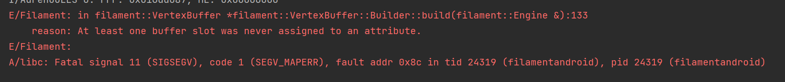 | n           |
| islandblender | 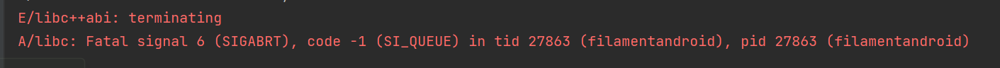 | n           |
| demo3         | E/AndroidRuntime: java.lang.RuntimeException: Unable to start activity ComponentInfo{com.reviling.filamentandroid/com.reviling.filamentandroid.Example}: java.io.**FileNotFoundException**: model/island/data:application/octet-stream;base64 | n           |
| demo2         | 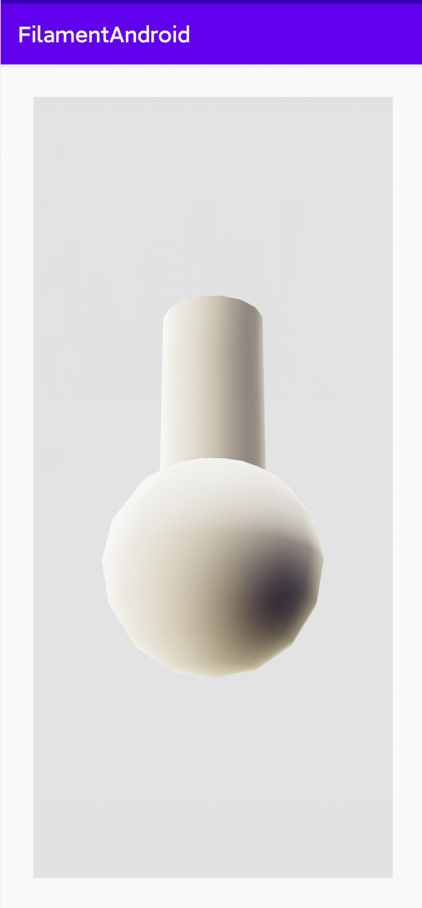 | y           |

## android openGL

官方文档 https://developer.android.com/reference/android/opengl/GLSurfaceView.Renderer

### 尝试

[Create your first OpenGL App with Android Studio - YouTube](https://www.youtube.com/watch?v=yip5CpVeOPI) 尝试通过这个视频教程编写第一个gl程序

#### 修改manifest

添加GL feature

```xml
<uses-feature android:glEsVersion="0x00020000" android:required="true"/>
```

编写OpenGLView类

编写OpenGLRenderer类，implements GLSurfaceView.Renderer

出现错误

`android.opengl.GLSurfaceView cannot be cast to com.example.open_gl_test1.OpenGLView`

## 3d knowledge related

### 3d model file formatting

1. obj
   1. obj文件是[3D模型](https://baike.baidu.com/item/3D模型/10831428)文件格式。由Alias|Wavefront公司为[3D建模](https://baike.baidu.com/item/3D建模/3867022)和动画软件"Advanced Visualizer"开发的一种标准，适合用于3D软件模型之间的互导，也可以通过Maya读写。
2. mtl
   1. (material library file)是材质库文件，描述物体的材质信息，ASCII存储
3. stl
   1. STL(Stereolithography)文件，有时被称为“标准三角语言”或“标准曲面细分语言”，由3D Systems于1987年创建，并且已被广泛用作全行业3D打印机模型的标准文件。